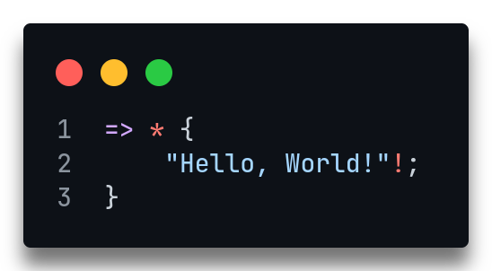

# Samarium

Samarium is a dynamic interpreted language transpiled to Python.
Samarium, in its most basic form, doesn't use any digits or letters.

Here's a `Hello, World!` program written in Samarium:

<span style="display: inline-block" align="left">
    
</span>

Note: Every statement in Samarium must end in a semicolon.

The following guide assumes that you are familiar with the basics of programming.


# Table of Contents

- [Samarium](#samarium)
- [Table of Contents](#table-of-contents)
- [Variables](#variables)
  - [Null](#null)
  - [Constants](#constants)
- [Numbers](#numbers)
  - [Random Numbers](#random-numbers)
- [Operators](#operators)
  - [Arithmetic](#arithmetic)
  - [Comparison](#comparison)
  - [Logic and Membership](#logic-and-membership)
  - [Bitwise](#bitwise)
  - [Assignment](#assignment)
- [Strings](#strings)
- [Arrays](#arrays)
  - [Array Comprehension](#array-comprehension)
- [Tables](#tables)
- [Slices](#slices)
- [Comments](#comments)
- [Built-in Functions](#built-in-functions)
  - [STDIN](#stdin)
  - [STDOUT](#stdout)
  - [STDERR](#stderr)
  - [EXIT](#exit)
  - [HASH](#hash)
  - [TYPEOF](#typeof)
  - [CAST](#cast)
  - [SPECIAL](#special)
  - [DTNOW](#dtnow)
  - [SLEEP](#sleep)
  - [ASSERT](#assert)
- [Control Flow](#control-flow)
  - [`if`/`else`](#ifelse)
  - [`foreach` loop](#foreach-loop)
  - [`while` loop](#while-loop)
  - [`break`/`continue`](#breakcontinue)
  - [`try`/`catch`](#trycatch)
- [Functions](#functions)
  - [Main Function](#main-function)
  - [Default Arguments](#default-arguments)
- [Modules](#modules)
  - [Importing](#importing)
- [File I/O](#file-io)
  - [Creating](#creating)
  - [Reading](#reading)
  - [Writing](#writing)
  - [Appending](#appending)
  - [Closing](#closing)
  - [Quick Operations](#quick-operations)


# Variables

Variables are defined using the assignment operator `:`, like so:
<p align="left">
    
</p>
Variables can have many types, such as integers, strings, arrays, tables, and null.
Functions and classes may also be treated as first-class variables.
Only letters and/or numbers can be used for variable names (case sensitive), thus camelCase is recommended for names consisting of multiple words.

## Null

The character `_` represents a null value, such as for default arguments in a function.
Assignments to `_` are not allowed.

## Constants

Variables can be made constant by prefixing them with `<>`.
Any attempt to assign a new value to a constant variable will raise a `TypeError`.

```
<>x: //;
x: \;
```

This example raises `[TypeError] object is immutable`.


# Numbers

Numbers are represented in base 2, using slashes and backslashes to represent 1 and 0 respectively.
Only integers are supported in Samarium.
Negative numbers are represented as normal, with a `-` sign before them.

Let's see some examples of numbers:

Base 10 | Base 2  | Samarium
---     | ---     | ---
`0`     | `0`     | `\`
`1`     | `1`     | `/`
`2`     | `10`    | `/\`
`3`     | `11`    | `//`
`5`     | `101`   | `/\/`
`8`     | `1000`  | `/\\\`
`13`    | `1101`  | `//\/`
`21`    | `10101` | `/\/\/`

Since Samarium is transpiled to Python, there's no limit to how large a number can be:

```
//\\/\\//////\\\\///\\////\\/\\/\\\\\\/////\\\\\\\\/////\\//\\/\\////\\////////\\////\\///\\\\\\\\//\\\\//\\///\\/\\\\\\/\\////\\//\\\\/\\\\/\\////\\/////\\/\\\\/\\\\\\\\\\//\\\\\\//\\\\/\\/\\\\//\\\\\\///\\/\\\\\\/\\\\\\/\\\\///\\//\\\\/\\\\//\\\\///\\//\\\\\\\\\\\\////////////////////////////////////////////////////////////////////////////////
```

Or in base 10:

```py
99999999999999999999999999999999999999999999999999999999999999999999999999999999
```

## Random Numbers

A random number in a particular range can be generated using `^^`, like so:

`^^/ -> /\/\^^` generates a random integer from 1 to 10 inclusive.

More random number generation-related functions can be found in the [`random` module](#random-module)


# Operators

## Arithmetic

Operator | Meaning
---      | ---
`+`      | Addition
`-`      | Subtraction
`++`     | Multiplication
`--`     | Integer division
`+++`    | Exponentiation
`---`    | Modulo

## Comparison

Operator | Meaning
---      | ---
`<`      | Less than
`>`      | Greater than
`<:`     | Less than or equal to
`>:`     | Greater than or equal to
`::`     | Equal to
`:::`    | Not equal to

## Logic and Membership

Operator | Meaning
---      | ---
`&&`     | Logical AND
`\|\|`   | Logical OR
`~~`     | Logical NOT
`->?`    | `x ->? y` returns 1 if `x` is a member of `y`, and 0 if not

## Bitwise

Operator | Meaning
---      | ---
`&`      | Bitwise AND
`\|`     | Bitwise OR
`~`      | Bitwise NOT
`^`      | Bitwise XOR

## Assignment

All arithmetic and bitwise operators (except `~`) can be used together with the assignment operator.

For example:

```
x: x - /\/;
x: x ++ //;
x: x --- /\\;
```

is equivalent to:

```
x-: /\/;
x++: //;
x---: /\\;
```


# Strings

Strings are defined using double quotation marks:

```rs
"Hello!"
```

Multiline strings do not require any additional syntax:

```rs
"This
is a
multiline
string"
```

Strings can be manipulated using some arithmetic operators:

`"hello" + "world"` is the same as `"helloworld"`

`"hello" ++ //` is the same as `"hellohellohello"`


# Arrays

Arrays are defined using square brackets:

```
[/, /\, //]
```

Arrays can be concatenated with the `+` operator:

`[/, /\] + [//]` is the same as `[/, /\, //]`

Elements can also be removed (by index) from an array using the `-` operator:

`[/, //\, /\, //] - /` gives `[/, /\, //]`

## Array Comprehension

Array comprehensions are a way to create an array based on another iterable.
Uses may include performing an operation on each element of the iterable, or creating a subsequence of those elements that satisfy a certain condition.

They are written similarly to [foreach loops](#foreach-loop); they can come in two forms, as follows:

```
[expression ... member ->? iterable]
[expression ... member ->? iterable ? condition]
```

For example, say we want to create an array of square numbers.
Here are two equivalent approaches:

```
input: [/, /\, //, /\\, /\/];

arr: [];
... n ->? input {
    arr+: [n ++ n];
}

arr: [n ++ n ... n ->? input];
```

In both cases, `arr` is equal to `[1, 4, 9, 16, 25]`.

Now suppose we want to filter this result to only the odd-numbered elements.
There are again two equivalent approaches:

```
arr: [/, /\\, /\\/, /\\\\, //\\/];

filtered: [];
... n ->? arr {
    ? n --- /\ :: / {
        filtered+: [n];
    }
}

filtered: [n ... n ->? arr ? n --- /\ :: /];
```

In both cases, `filtered` is equal to `[1, 9, 25]`.


# Tables

Tables are defined using double curly brackets:

```hs
{{"key" -> "value", / -> //\}}
```


# Slices

Slices are used to access a range of elements in an iterable (strings, arrays, keys of a table).
They don't do anything by themselves.
Slices are enclosed in double angle brackets.
They have three parameters, `start`, `stop` and `step`, any of which may be omitted.
`..` is used to indicate `stop`, and `**` is used to indicate `step`.

```hs
str: "abcdefgh";
str<<\>> :: "a";
str<<//..//\>> :: "def";
str<</..//\**/\>> :: "bdf";
```

All valid slice parameters are as follows:
Slice                   | Returns
---                     | ---
`<<>>`                  | the whole iterable
`<<index>>`             | the element at position `index`
`<<..stop>>`            | all elements up to index `stop`
`<<**step>>`            | all elements separated by gaps of size `step`
`<<start..>>`           | all elements starting from index `start`
`<<..stop**step>>`      | all elements up to index `stop` separated by gaps of size `step`
`<<start**step>>`       | all elements starting from index `start` separated by gaps of size `step`
`<<start..stop>>`       | all elements starting from index `start` up to index `stop`
`<<start..stop**step>>` | all elements starting from index `start` up to index `stop` separated by gaps of size `step`


# Comments

Comments are written using `==`, and comment blocks are written with `==<` and `>==`:

```
== single-line comment

==< comment block
doesn't end
on newlines >==
```


# Built-in Functions

## STDIN

Standard input can be read from with `???`.
It will read until it receives a newline character.

`x: ???` will assign to `x` as a string what it reads from standard input, stopping at a newline character.

A prompt can be given by preceding the `???` with a string, for example `"input: "???`

## STDOUT

Objects can be written to standard output by appending a `!` character to them.
Note that they won't be written exactly as they would appear in Samarium.

`"a"!` will write `a` to standard output.

`//\/!` will write `13` to standard output.

This function will return what it writes to stdout (though not necessarily as a string), and can thus be used in an assignment statement for example.

```
x: //\!;
== the string "6" is written to stdout, and `x` now has the value 6 (integer)
```

## STDERR

Similarly to STDOUT, objects can be written to standard error using `!!!`.
This will throw an error, and exit the program if the error is not caught.

`"exception raised"!!!` will write `[Error] exception raised` to standard error.

## EXIT

The program may be exited with `=>!`.
If a particular exit code is desired, it may be put after the exclamation mark:

`=>! //` will exit the program with exit code 3.

## HASH

The hash function `##` returns as an integer the hash value of an object if it has one (arrays and tables do not).
The value it returns will remain consistent for the life of the program, but may vary if the program is run multiple times.

`"hash"##` will return the hash value of the string `"hash"`.

## TYPEOF

The typeof function `?!` returns the type of an object, as an instance of the `Type` class.

`/?!` returns `Integer`.

`"abc"?!` returns `String`.

`/?!?!` returns `Type`.

These instances are callable and can be used to convert variables into that type, like so:

```
/?!("123")!;
== writes `123` (as an integer) to stdout
```

## CAST

The cast function `%` can convert between a Unicode character (a string) and its corresponding code (an integer).

`"a"%` returns `97`.

`/\\\\/%` returns `"!"`.

## SPECIAL

The special function `$` has different uses depending on the type of object it's used on.

Object  | Function
---     | ---
Integer | Returns the binary representation of the number as a string
String  | Returns the length of the string
Array   | Returns the length of the array
Table   | Returns an array of the table's values

For example:

```
"string"$!;     == writes `6` to stdout
```

## DTNOW

The dtnow function `@@` gets the system's current date and time as an array of integers, in the format `[year, month, day, hour, minute, second, millisecond, utc_hour_offset, utc_minute_offset]`.

## SLEEP

The sleep function `,.,` pauses execution for the specified number of milliseconds.

```
,., /////\/\\\;     == sleep for 1000 milliseconds (1 second)
```

## ASSERT

The assert function `#` is used as a debugging tool.
If the input to this function is falsy (i.e. empty iterable, null, or just false), an `AssertionError` will be raised, otherwise, nothing will happen.
A custom error message can be provided by putting it after a `->`.

```
# / > /\, "error message";
```
will raise `[AssertionError] error message`.


# Control Flow

## `if`/`else`

`if` statements are written using a `?` character, and `else` is written as `,,`.
Blocks are enclosed in curly brackets.
`else if` can be written using `,, ?`.

```
? x < \ {
    "x is negative"!;
} ,, ? x > \ {
    "x is positive"!;
} ,, {
    "x = 0"!;
}
```

## `foreach` loop

`foreach` loops are written using `...`, and enclosed in curly brackets.
Each of these loops must be paired with a `->?` operator, indicating the object to iterate over.

```
arr: [];
... char ->? "string" {
    arr+: [char];
}
== arr :: ["s", "t", "r", "i", "n", "g"]
```

## `while` loop

`while` loops are written with `..`, and enclosed in curly brackets.
The loop condition follows the `..`.

```
x: \;
.. x < /\/\ {
    x+: /\;
    x!;
}
== prints 2, 4, 6, 8, 10
```

## `break`/`continue`

`break` statements are written with `<-`, and terminate the enclosing loop immediately.
They can be used in both `for` and `while` loops.

```
x: \;
.. x < /\/ {
    x+: /;
    ? x :: // {
        <-;
    }
    x!;
}
```

This program will print 1, 2, and then terminate the `while` loop on the third iteration, before printing 3.

`continue` statements are written with `->`, and immediately finish the current iteration of the enclosing loop.
These can also be used in both `for` and `while` loops.

```
x: \;
.. x < /\/ {
    x+: /;
    ? x :: // {
        ->;
    }
    x!;
}
```

This program will print 1, 2, skip the third iteration of the `while` loop, then print 4, 5, and end the loop normally.

## `try`/`catch`

`try`-`catch` statements are used for error handling.
`try` clauses are written with `??`, and enclosed in curly brackets.
If, during execution of the contents of the `try` clause, an error is thrown, the rest of the clause is skipped, the error will be silenced, and the adjoining `catch` clause will be executed.
`catch` clauses are written with `!!`, and are also enclosed in curly brackets.

```
?? {
    == error prone code here...
    / -- \;
    "unreachable"!;
} !! {
    "error caught"!;
}
```


# Functions

Functions are defined using the `*` character.
Both the function's name and its parameters come before this `*` character, in that order, separated by spaces.
The function body is enclosed in curly brackets.
The function's return value is preceded by a `*` character as well.
(Functions may also have multiple return statements, or none at all.)

```
func arg1 arg2 * {
    sum: arg1 + arg2;
    * sum;
}
```

Calling a function is done as in C-like languages, with the function name, followed by its arguments in parentheses, separated by commas.

```
a: /;
b: /\;
c: func(a, b);      == using `func` from the previous example (c = 3)
```

## Main Function

The main function/entrypoint of the program is denoted by `=>`.
This function will be implicitly called on execution of the program.
The return value of the main function indicates the exit code of the program (optional, defaults to 0).
Attempts to write to stdout outside the scope of this or any other function will be ignored.
Command line arguments can be gotten as an array with an optional parameter in this function.

```
=> argv * {
    == program here...
}
```

## Default Arguments

Default arguments may be given by using the assignment operator in the function definition.
Default arguments must come after any other arguments.

```
func a b c: "arg" d: _ * {
    == ...
}

func(/, /\);
func(/, /\, //);
func(/, /\, //, /\\);   == all valid calls
```


# Modules

Modules can contain functions and variables that a user may wish to import.
Modules are named after their filename (with `.sm` omitted).
Like variables, module names must consist of only letters and numbers, and are case sensitive.

## Importing

Modules can be imported using the `<-` operator, followed by the module's name.
Objects (classes, functions, variables) from this module can then be accessed with the `.` operator.

```
<-string;                 == imports the `string` module from Samarium's standard library

string.toUpper("abc")!;   == prints "ABC"

string.digits!;           == prints "0123456789"
```

Objects can also be directly imported from a module one by one, in which case they don't need to be preceded by the module name when using them:

```
<-math.sqrt, abs;

sqrt(/\\/)!;      == prints 3
abs(-/\)!;        == prints 2
```

All objects in a module can be directly imported at once by using the wildcard character `*`.
Importing everything in this way is typically advised against, as it may cause poorly readable code and/or name collisions.

```
<-math.*;

factorial(//)!;   == prints 6
```


# File I/O

Files are handled through file I/O objects, which can be in one of several modes: read, write, read & write, append, and as either text or binary for each of these.
File I/O objects have a cursor, which is updated whenever data is written to/read from the object.
The current cursor position can be gotten like so:

```
pos: f<<>>;
== assuming `f` is a file I/O object
```

## Creating

Files can be created with the unary `?~>` operator.
`?~> "file.txt"` will create an empty file called `file.txt` in the program directory.

Note: files will also be created if they are opened in write or append mode.

## Reading

Files can be opened for reading in two ways:

```
f <~~ "file.txt";
== opens `file.txt` for reading, in text mode, and stores the file I/O object in `f`.

f <~% "file.bin";
== opens `file.bin` for reading, in binary mode, and stores the file I/O object in `f`.
```

These file I/O objects can be read into a variable (a string for text mode, and an array of integers for binary mode) for use in the program.

```
string <~ f;
== reads the full contents of the file I/O object `f` into `string` (assuming `f` is in text read mode)

array <% f;
== reads the full contents of the file I/O object `f` into `array` (assuming `f` is in binary read mode)
```

## Writing

Files can be opened for writing in two ways:

```
f ~~> "file.txt";
== opens/creates `file.txt` for writing, in text mode, and stores the file I/O object in `f`.

f %~> "file.bin";
== opens/creates `file.bin` for writing, in binary mode, and stores the file I/O object in `f`.
```

These file I/O objects can be written to from a variable (a string for text mode, and an array of integers for binary mode).

```
string ~> f;
== writes the entirety of `string` into the file I/O object `f` (assuming `f` is in text write mode)

array %> f;
== writes the entirety of `array` into the file I/O object `f` (assuming `f` is in binary write mode)
```

## Appending

Files can be opened for appending in two ways:

```
f &~~> "file.txt";
== opens/creates `file.txt` for appending, in text mode, and stores the file I/O object in `f`.

f &%~> "file.bin";
== opens/creates `file.bin` for appending, in binary mode, and stores the file I/O object in `f`.
```

The contents of these file I/O objects can be added to from a variable (a string for text mode, and an array of integers for binary mode).

```
string &~> f;
== appends the entirety of `string` to the current contents of file I/O object `f` (assuming `f` is in text append mode)

array &%> f;
== appends the entirety of `array` to the current contents of the file I/O object `f` (assuming `f` is in binary append mode)
```

## Closing

Files can be closed with the `~` operator.
If files are not closed manually by the user, they will be automatically closed once the program terminates.
Note that the file I/O object will not be released from memory, but it still cannot be used.

```
~f;   == closes the file I/O object `f`
```

## Quick Operations

Files can be read from, written to or appended to directly using the filename, with quick operations.
These will open the file in the relevant mode, perform the operation, and close it, all in one.

Mode          | Operator
---           | ---
Text read     | `<~`
Text write    | `~>`
Text append   | `&~>`
Binary read   | `<%`
Binary write  | `%>`
Binary append | `&%>`

For example:

```
string ~> "file.txt";
== writes the entirety of `string` directly into `file.txt`

array <% "file.bin";
== reads the full contents of `file.bin` directly into `array`
```
