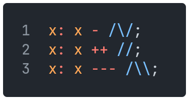
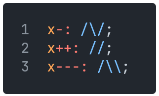

[Back](01integers.md) | [Table of Contents](tableofcontents.md) | [Next](03strings.md)
---                   | ---                                     | ---

# Operators

## Arithmetic

Operator | Meaning
---      | ---
`+`      | Addition
`-`      | Subtraction
`++`     | Multiplication
`--`     | Integer division
`+++`    | Exponentiation
`---`    | Modulo

## Comparison

Operator | Meaning
---      | ---
`<`      | Less than
`>`      | Greater than
`<:`     | Less than or equal to
`>:`     | Greater than or equal to
`::`     | Equal to
`:::`    | Not equal to

## Logic and Membership

Operator | Meaning
---      | ---
`&&`     | Logical AND
`\|\|`   | Logical OR
`~~`     | Logical NOT
`->?`    | `x ->? y` returns 1 if `x` is a member of `y`, and 0 if not

## Bitwise

Operator | Meaning
---      | ---
`&`      | Bitwise AND
`\|`     | Bitwise OR
`~`      | Bitwise NOT
`^`      | Bitwise XOR

## Assignment

All arithmetic and bitwise operators (except `~`) can be used together with the assignment operator.

For example:

    

is equivalent to:

    

