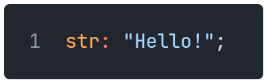
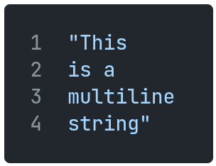

[Back to Table of Contents](../README.md#table-of-contents)

# Strings

Strings are defined using double quotation marks:

    

Multiline strings do not require any additional syntax:

    

Strings can be manipulated using some arithmetic operators:

`"hello" + "world"` is the same as `"helloworld"`

`"hello" ++ //` is the same as `"hellohellohello"`
