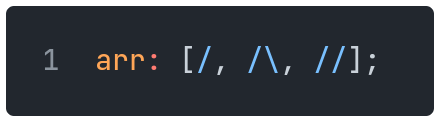

[Back](03strings.md) | [Table of Contents](../README.md#table-of-contents) | [Next](05tables.md)
---                  | ---                                                 | ---

# Arrays

Arrays are defined using square brackets, with elements separated by commas:

    

Arrays can be concatenated with the `+` operator:

`[/, /\] + [//]` is the same as `[/, /\, //]`

Elements can also be removed (by index) from an array using the `-` operator:

`[/, //\, /\, //] - /` gives `[/, /\, //]`

## Array Comprehension

Array comprehensions are a way to create an array based on another iterable.
Uses may include performing an operation on each element of the iterable, or creating a subsequence of those elements that satisfy a certain condition.

They are written similarly to [foreach loops](09controlflow.md#foreach-loop); they can come in two forms, as follows:

    

For example, say we want to create an array of square numbers.
Here are two equivalent approaches:

    

In both cases, `arr` is equal to `[1, 4, 9, 16, 25]`.

Now suppose we want to filter this result to only the odd-numbered elements.
There are again two equivalent approaches:

    

In both cases, `filtered` is equal to `[1, 9, 25]`.
