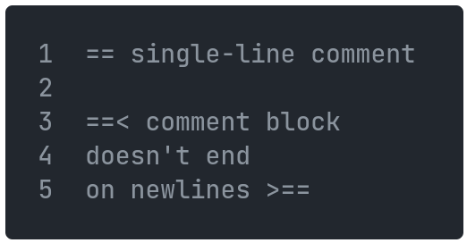

[Back](03strings.md) | [Table of Contents](tableofcontents.md) | [Next](05arrays.md)
---                 | ---                                     | ---

# Comments

Comments are written using `==`, and comment blocks are written with `==<` and `>==`:

    

