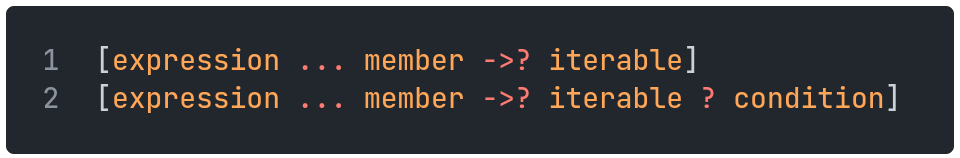
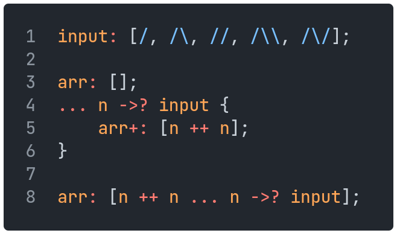
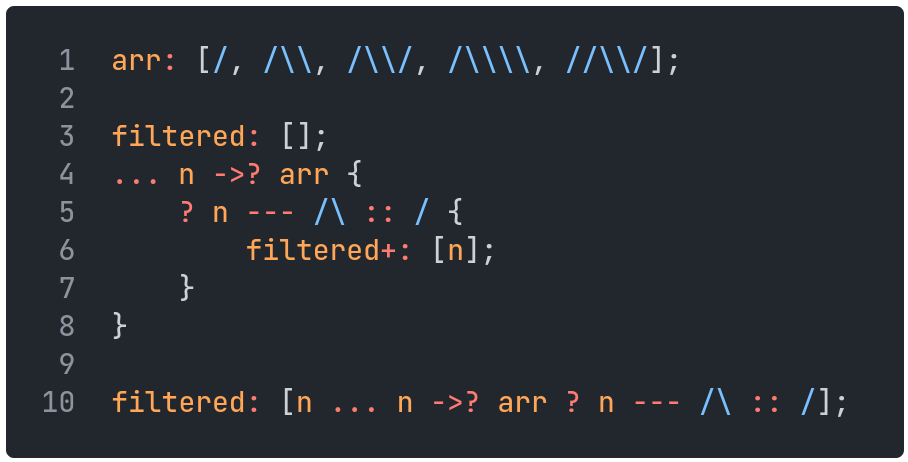

# Arrays

Arrays are defined using square brackets, with items separated by commas:

```sm
[\, /\, //]
```

Arrays can be concatenated with the `+` operator:

`[/, /\] + [//]` is the same as `[/, /\, //]`

Items can also be removed from an array using the `-` operator, either by index or by value. Removing an element by value will remove only the first instance of that value in the array.

`["a", "b", "c"] - /` gives `["a", "c"]`

`["a", "b", "c", "d"] - ["b", "d"]` gives `["a", "c"]`

## Array Comprehension

Array comprehensions are a way to create an array based on another iterable.
Uses may include performing an operation on each item of the iterable, or creating a subsequence of those items that satisfy a certain condition.

They are written similarly to [foreach loops](09controlflow.md#foreach-loop); they can come in two forms, as follows:

<p align="left">
    
</p>

For example, say we want to create an array of square numbers.
Here are two equivalent approaches:

<p align="left">
    
</p>

In both cases, `arr` is equal to `[1, 4, 9, 16, 25]`.

Now suppose we want to filter this result to only the odd-numbered items.
There are again two equivalent approaches:

<p align="left">
    
</p>

In both cases, `filtered` is equal to `[1, 9, 25]`.
