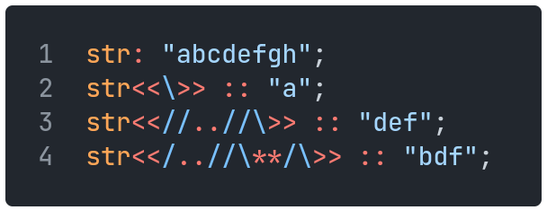

[Back](05tables.md) | [Table of Contents](../README.md#table-of-contents) | [Next](07comments.md)
---                 | ---                                                 | ---

# Slices

Slices are used to access a range of elements in an iterable (strings, arrays, tables).
They don't do anything by themselves.
Slices are enclosed in double angle brackets.
They have three parameters, `start`, `stop` and `step`, any of which may be omitted.
`..` is used to indicate `stop`, and `**` is used to indicate `step`.

    

All valid slice parameters are as follows:
Slice                   | Returns
---                     | ---
`<<>>`                  | the whole iterable
`<<index>>`             | the element at position `index`
`<<..stop>>`            | all elements up to index `stop`
`<<**step>>`            | all elements separated by gaps of size `step`
`<<start..>>`           | all elements starting from index `start`
`<<..stop**step>>`      | all elements up to index `stop` separated by gaps of size `step`
`<<start**step>>`       | all elements starting from index `start` separated by gaps of size `step`
`<<start..stop>>`       | all elements starting from index `start` up to index `stop`
`<<start..stop**step>>` | all elements starting from index `start` up to index `stop` separated by gaps of size `step`
