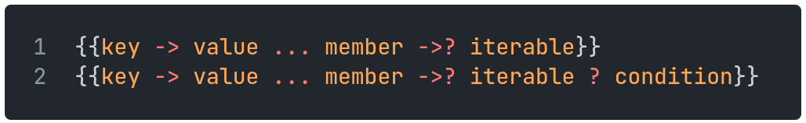
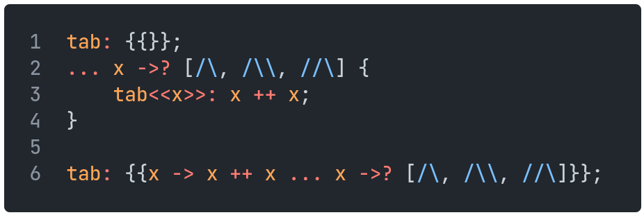

# Tables

Tables map hashable values to arbitrary objects.
They are defined using double curly brackets, with `->` mapping each key to each value:

```sm
tab: {{"key" -> "value", / -> [/\, "a"]}};
```

A table may be indexed by its keys, which will return their corresponding values, for example, from the previous table:

`tab<<"key">>` returns `"value"`

`tab<</>>` returns `[2, "a"]`

After its initialization, the items of a table can be set using this indexing syntax.
If the key doesn't already exist in the table, it will be created.

`tab<<"key">>: "newvalue"` will overwrite the previous value of `tab<<"key">>`.

`tab<<"newkey">>: //\` will create a new item in the table, with key `"newkey"` and value `6`.

Tables can be merged together with the addition operator `+`.
The values of the table to the right of the operator take priority when both tables share keys.

Items can be removed from a table by key using the subtraction operator `-`:

`{{"a" -> /, "b" -> /\, // -> /\//}} - "b"` gives `{{"a" -> /, // -> /\//}}`

## Table Comprehension

Tables can be created using table comprehension, using a similar syntax to [array comprehensions](04arrays.md#array-comprehension):

<p align="left">
    
</p>

For example, both of the following approaches are equivalent:

<p align="left">
    
</p>

In both cases, `tab` is equal to `{{2 -> 4, 4 -> 16, 6 -> 36}}`
