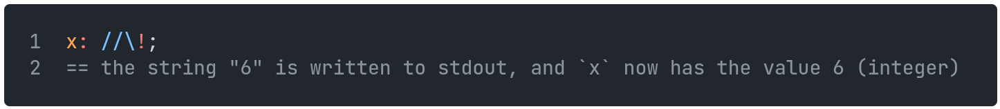
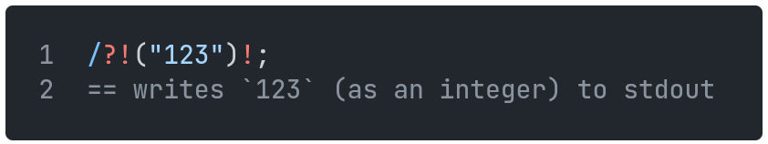
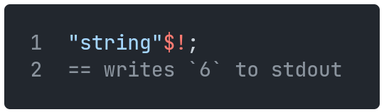
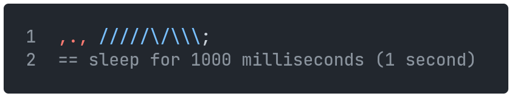
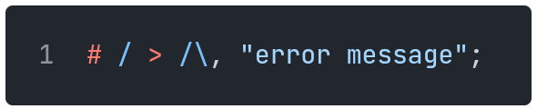

[Back](08tables.md) | [Table of Contents](tableofcontents.md) | [Next](10controlflow.md)
---                   | ---                                     | ---

# Built-in Functions

## STDIN

Standard input can be read from with `???`.
It will read until it receives a newline character.

`x: ???` will assign to `x` as a string what it reads from standard input, stopping at a newline character.

A prompt can be given by preceding the `???` with a string, for example `"input: "???`

## STDOUT

Objects can be written to standard output by appending a `!` character to them.
Note that they won't be written exactly as they would appear in Samarium.

`"a"!` will write `a` to standard output.

`//\/!` will write `13` to standard output.

This function will return what it writes to stdout (though not necessarily as a string), and can thus be used in an assignment statement for example.

    

## STDERR

Similarly to STDOUT, objects can be written to standard error using `!!!`.
This will throw an error, and exit the program if the error is not caught.

`"exception raised"!!!` will write `[Error] exception raised` to standard error.

## EXIT

The program may be exited with `=>!`.
If a particular exit code is desired, it may be put after the exclamation mark:

`=>! //` will exit the program with exit code 3.

## HASH

The hash function `##` returns as a integer the hash value of an object if it has one (arrays and tables do not).
The value it returns will remain consistent for the life of the program, but may vary if the program is run multiple times.

`"hash"##` will return the hash value of the string `"hash"`.

## TYPEOF

The typeof function `?!` returns the type of an object, as an instance of the `Type` class.

`/?!` returns `Integer`.

`"abc"?!` returns `String`.

`/?!?!` returns `Type`.

These instances are callable and can be used to convert variables into that type, like so (currently only works for integers):

    

## CAST

The cast function `%` can convert between a Unicode character (a string) and its corresponding code (an integer).

`"a"%` returns `97`.

`/\\\\/%` returns `"!"`.

## SPECIAL

The special method `$` has different uses depending on the type of object it's used on.

Object   | Use
---      | ---
Function | Returns the number of parameters the function has
Integer  | Returns the binary representation of the integer as a string
String   | Returns the length of the string
Array    | Returns the length of the array
Table    | Returns an array of the table's values

For example:

    

## DTNOW

The dtnow function `@@` gets the system's current date and time as an array of integers, in the format `[year, month, day, hour, minute, second, millisecond, utc_hour_offset, utc_minute_offset]`.

## SLEEP

The sleep function `,.,` pauses execution for the specified number of milliseconds.

    

## ASSERT

The assert function `#` is used as a debugging tool.
If the input to this function is falsy (i.e. empty iterable, null, or just false), an `AssertionError` will be raised, otherwise, nothing will happen.
A custom error message can be provided by putting it after a `,`.

    

will raise `[AssertionError] error message`.

## PARENT

The parent function `!?` gets the parent/inherited classes of the input class.
If a class only has one parent, it will be return directly.
If a class has multiple parents, they will be returned in an array, in the same order as in the class definition.

Note that this will only go one layer deep, i.e. if class `A` has parent `B` and class `B` has parent `C`, `A!?` will only return `B`, and `A!?!?` will return `C`.

## RANDOM

The special method `??` has different uses depending on the type of object it's used on.

Object  | Use
---     | ---
Array   | Returns a random element
Integer | Returns a random integer from an interval based on its value `n = 0` → `0` `n > 0` → `[0, n)` `n < 0` → `[n, 0)`
Slice   | Returns a random number that fits the slice's conditions
String  | Returns a random character
Table   | Returns a random key