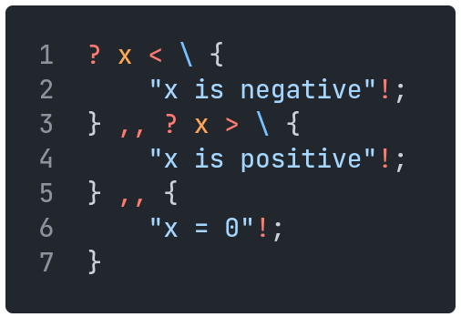
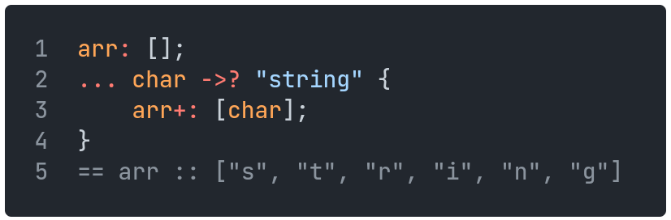
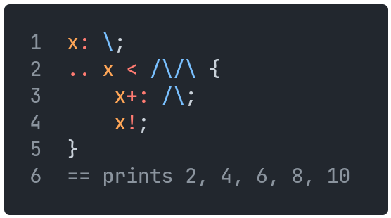
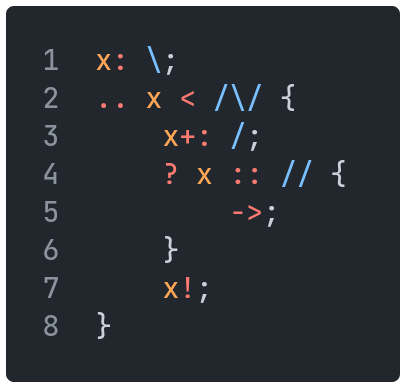
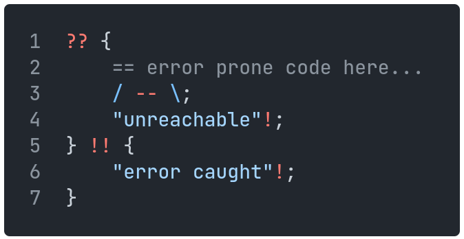

[Back to Table of Contents](../README.md#table-of-contents)

# Control Flow

## `if`/`else`

`if` statements are written using a `?` character, and `else` is written as `,,`.
Blocks are enclosed in curly brackets.
`else if` can be written using `,, ?`.

    

## `foreach` loop

`foreach` loops are written using `...`, and enclosed in curly brackets.
Each of these loops must be paired with a `->?` operator, indicating the object to iterate over.

    

## `while` loop

`while` loops are written with `..`, and enclosed in curly brackets.
The loop condition follows the `..`.

    

## `break`/`continue`

`break` statements are written with `<-`, and terminate the enclosing loop immediately.
They can be used in both `for` and `while` loops.

    

This program will print 1, 2, and then terminate the `while` loop on the third iteration, before printing 3.

`continue` statements are written with `->`, and immediately finish the current iteration of the enclosing loop.
These can also be used in both `for` and `while` loops.

    

This program will print 1, 2, skip the third iteration of the `while` loop, then print 4, 5, and end the loop normally.

## `try`/`catch`

`try`-`catch` statements are used for error handling.
`try` clauses are written with `??`, and enclosed in curly brackets.
If, during execution of the contents of the `try` clause, an error is thrown, the rest of the clause is skipped, the error will be silenced, and the adjoining `catch` clause will be executed.
`catch` clauses are written with `!!`, and are also enclosed in curly brackets.

    

