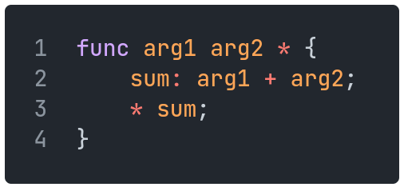
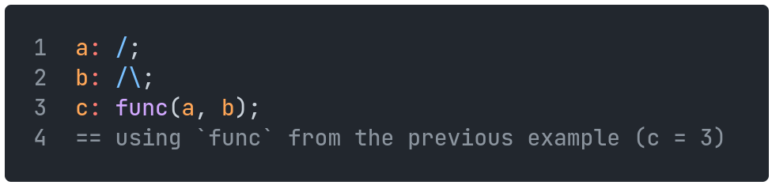
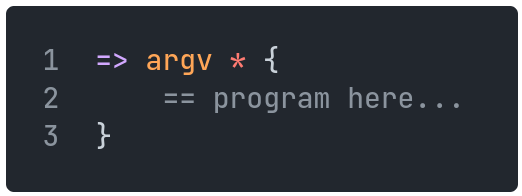
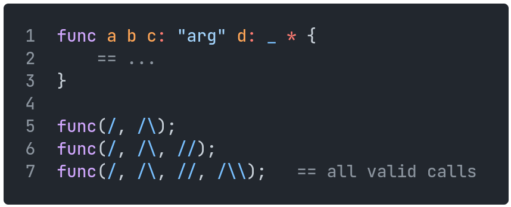

[Back to Table of Contents](../README.md#table-of-contents)

# Functions

Functions are defined using the `*` character.
Both the function's name and its parameters come before this `*` character, in that order, separated by spaces.
The function body is enclosed in curly brackets.
The function's return value is preceded by a `*` character as well.
(Functions may also have multiple return statements, or none at all.)

    

Calling a function is done as in C-like languages, with the function name, followed by its arguments in parentheses, separated by commas.

    

## Main Function

The main function/entrypoint of the program is denoted by `=>`.
This function will be implicitly called on execution of the program.
The return value of the main function indicates the exit code of the program (optional, defaults to 0).
Attempts to write to stdout outside the scope of this or any other function will be ignored.
Command line arguments can be gotten as an array with an optional parameter in this function.

    

## Default Arguments

Default arguments may be given by using the assignment operator in the function definition.
Default arguments must come after any other arguments.

    

