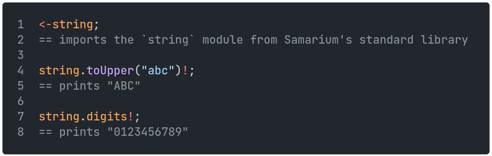
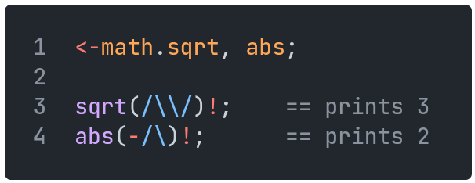
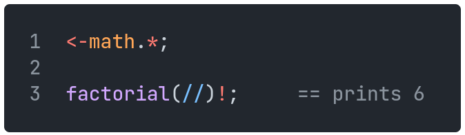

[Back](11functions.md) | [Table of Contents](tableofcontents.md) | [Next](13classes.md)
---                    | ---                                     | ---

# Modules

Modules can contain functions and variables that a user may wish to import.
Modules are named after their filename (with `.sm` omitted).
Like variables, module names must consist of only letters and numbers, and are case sensitive.

## Importing

Modules can be imported using the `<-` operator, followed by the module's name.
Objects (classes, functions, variables) from this module can then be accessed with the `.` operator.

    

Objects can also be directly imported from a module one by one, in which case they don't need to be preceded by the module name when using them:

    

All objects in a module can be directly imported at once by using the wildcard character `*`.
Importing everything in this way is typically advised against, as it may cause poorly readable code and/or name collisions.

    

