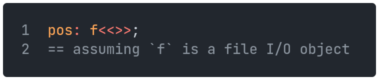
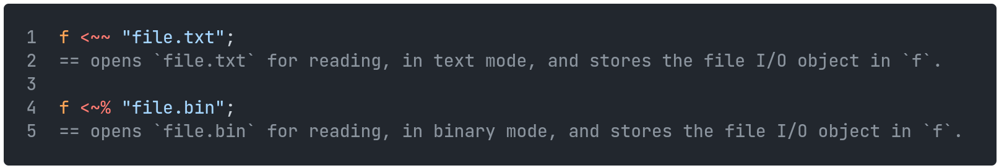
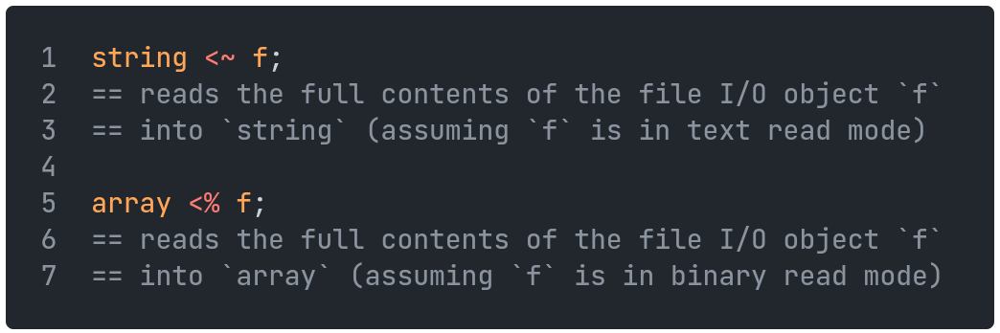
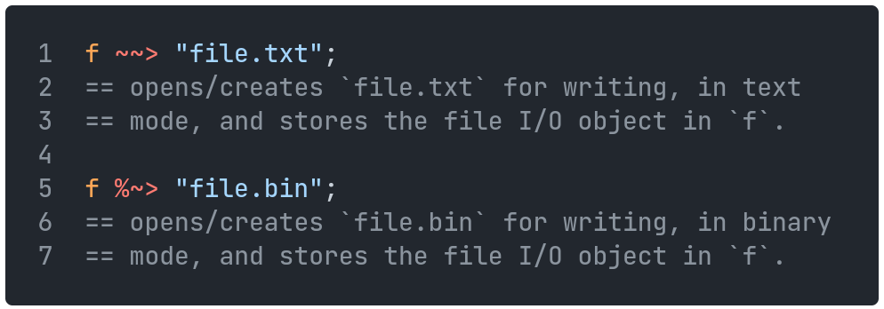
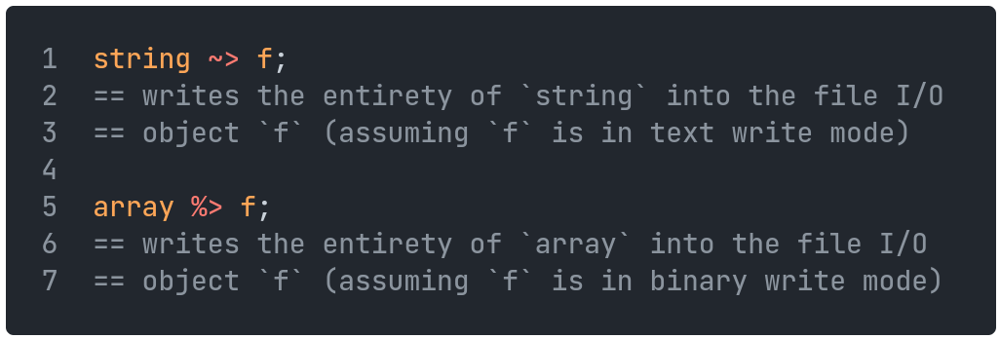
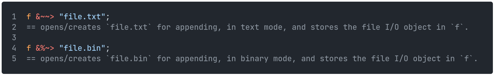
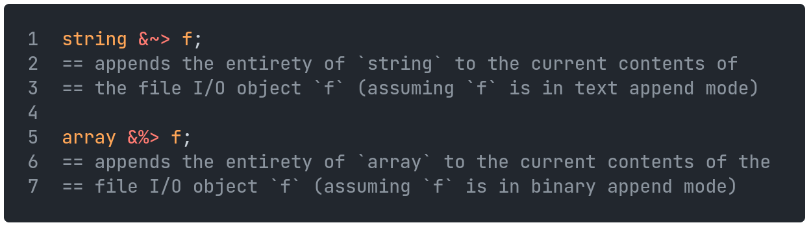
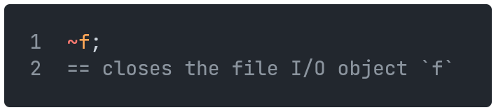
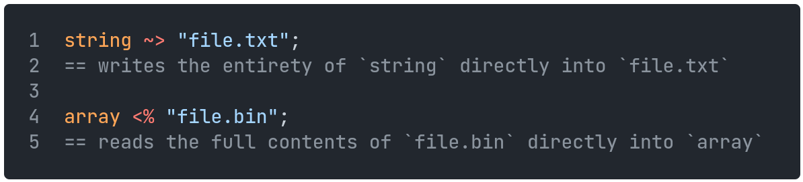

[Back to Table of Contents](../README.md#table-of-contents)

# File I/O

Files are handled through file I/O objects, which can be in one of several modes: read, write, read & write, append, and as either text or binary for each of these.
File I/O objects have a cursor, which is updated whenever data is written to/read from the object.
The current cursor position can be gotten like so:

    

## Creating

Files can be created with the unary `?~>` operator.
`?~> "file.txt"` will create an empty file called `file.txt` in the program directory.

Note: files will also be created if they are opened in write or append mode.

## Reading

Files can be opened for reading in two ways:

    

These file I/O objects can be read into a variable (a string for text mode, and an array of integers for binary mode) for use in the program.

    

## Writing

Files can be opened for writing in two ways:

    

These file I/O objects can be written to from a variable (a string for text mode, and an array of integers for binary mode).

    

## Appending

Files can be opened for appending in two ways:

    

The contents of these file I/O objects can be added to from a variable (a string for text mode, and an array of integers for binary mode).

    

## Closing

Files can be closed with the `~` operator.
If files are not closed manually by the user, they will be automatically closed once the program terminates.
Note that the file I/O object will not be released from memory, but it still cannot be used.

    

## Quick Operations

Files can be read from, written to or appended to directly using the filename, with quick operations.
These will open the file in the relevant mode, perform the operation, and close it, all in one.

Mode          | Operator
---           | ---
Text read     | `<~`
Text write    | `~>`
Text append   | `&~>`
Binary read   | `<%`
Binary write  | `%>`
Binary append | `&%>`

For example:

    

